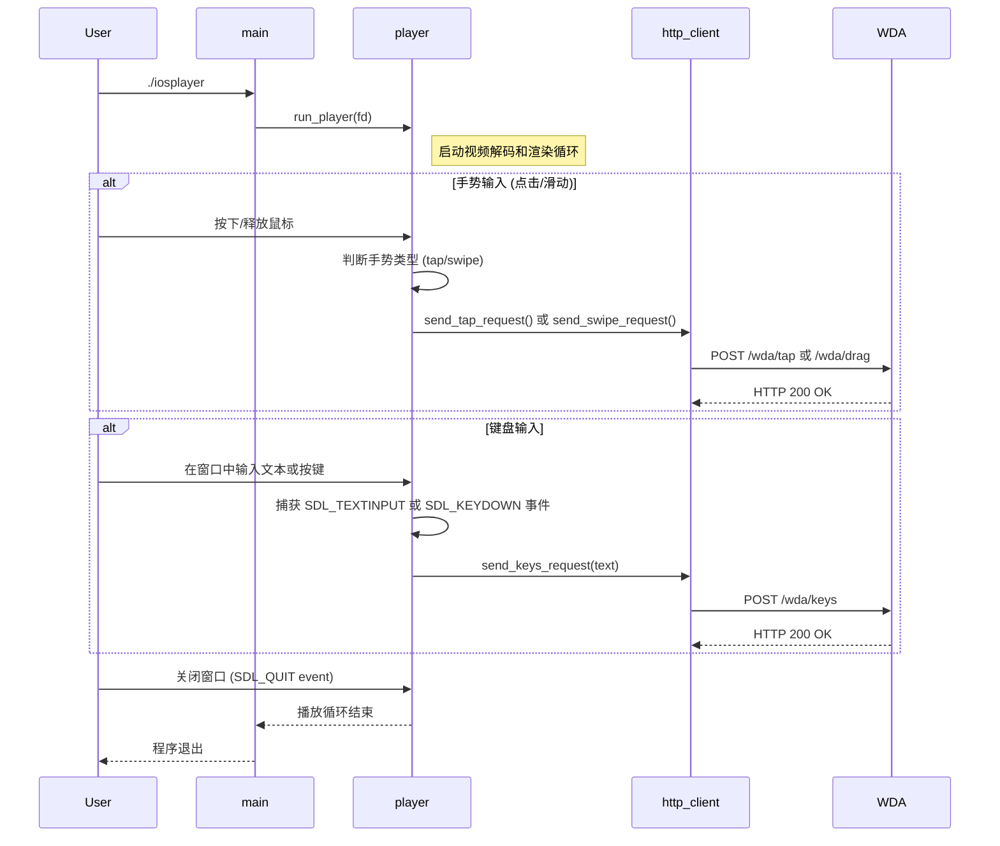
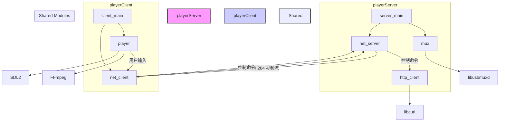
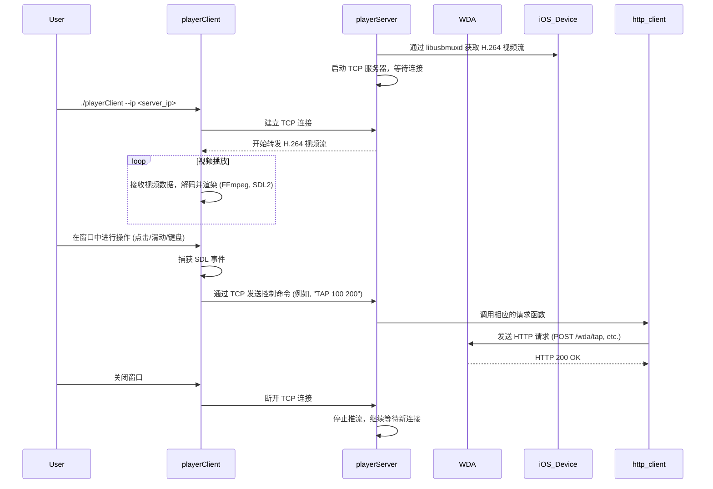

# 项目架构说明

本文档旨在说明 `iosplayer` 项目的软件架构、模块划分以及执行流程。

## 1. 单体模式 (Standalone Mode)

这是 `iosplayer` 程序的默认工作模式。

### 1.1 模块关系图 (Component Diagram)

项目被划分为四个核心模块和一个主入口：

- **`main`**: 程序的入口，负责初始化和协调其他模块。
- **`cli`**: 命令行接口模块，负责解析用户输入的参数。
- **`mux`**: USB多路复用模块，封装了 `libusbmuxd` 的功能，用于与iOS设备建立连接。
- **`player`**: 播放器核心模块，封装了 `FFmpeg` 和 `SDL` 的功能，负责视频流的解码、渲染以及用户交互（点击、滑动和键盘输入）。
- **`http_client`**: HTTP客户端模块，封装了 `libcurl` 的功能，用于向 WebDriverAgent 发送控制命令（如 `tap`, `drag`, `keys`）。

```mermaid
graph TD
    subgraph "`iosplayer` (Standalone)"
        A[main] --> B[cli]
        A --> C[mux]
        A --> D[player]
        D -- "用户手势和键盘输入" --> E[http_client]
    end

    subgraph Dependencies
        C --> F[libusbmuxd]
        D --> G[FFmpeg]
        D --> H[SDL2]
        E --> I[libcurl]
    end

    B -- "解析参数" --> A
    C -- "返回文件描述符 (fd)" --> A
    A -- "传递 fd" --> D

    style Application fill:#f9f,stroke:#333,stroke-width:2px
    style Dependencies fill:#ccf,stroke:#333,stroke-width:2px
```

### 1.2 执行流程图 (Sequence Diagram)



---

## 2. 客户端/服务器模式 (Client/Server Mode)

此模式将功能拆分为两个独立的程序：`playerServer` 和 `playerClient`。

- **`playerServer`**: 运行在与iOS设备直连的机器上。它负责从设备获取视频流，并将其通过TCP网络转发给客户端。同时，它接收来自客户端的控制命令，并将其转化为对 WebDriverAgent 的HTTP请求。
- **`playerClient`**: 运行在任意机器上。它连接到 `playerServer`，接收并播放视频流，同时将用户的输入操作（点击、滑动、键盘）发送回服务器进行处理。

### 2.1 模块关系与复用



### 2.2 C/S 交互流程图


