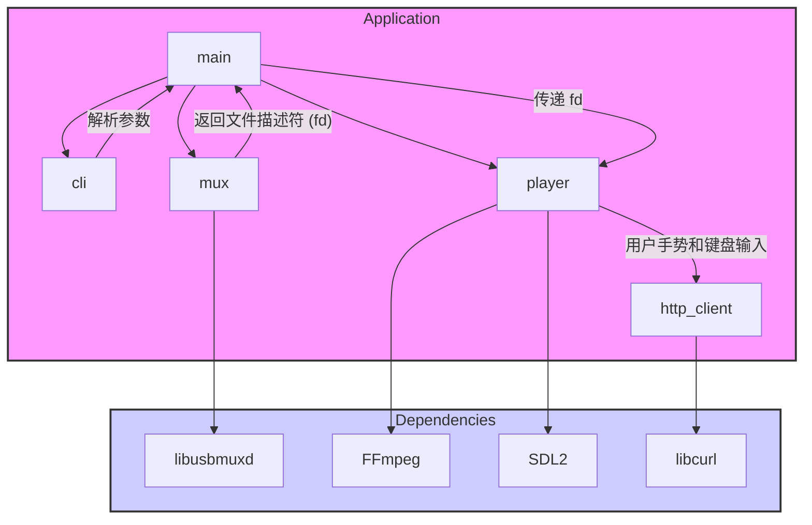
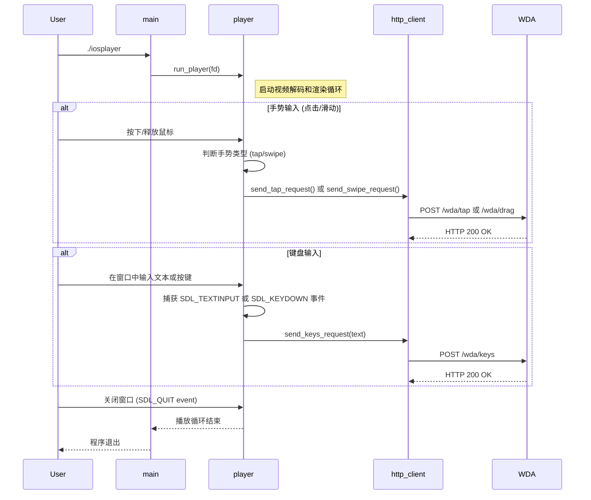

# 项目架构说明

本文档旨在说明 `iosplayer` 项目的软件架构、模块划分以及执行流程。

## 1. 模块关系图 (Component Diagram)

项目被划分为四个核心模块和一个主入口：

- **`main`**: 程序的入口，负责初始化和协调其他模块。
- **`cli`**: 命令行接口模块，负责解析用户输入的参数。
- **`mux`**: USB多路复用模块，封装了 `libusbmuxd` 的功能，用于与iOS设备建立连接。
- **`player`**: 播放器核心模块，封装了 `FFmpeg` 和 `SDL` 的功能，负责视频流的解码、渲染以及用户交互（点击、滑动和键盘输入）。
- **`http_client`**: HTTP客户端模块，封装了 `libcurl` 的功能，用于向 WebDriverAgent 发送控制命令（如 `tap`, `drag`, `keys`）。

## 2. 执行流程图 (Sequence Diagram)

下图展示了程序从启动到响应用户各种输入的完整执行流程。

